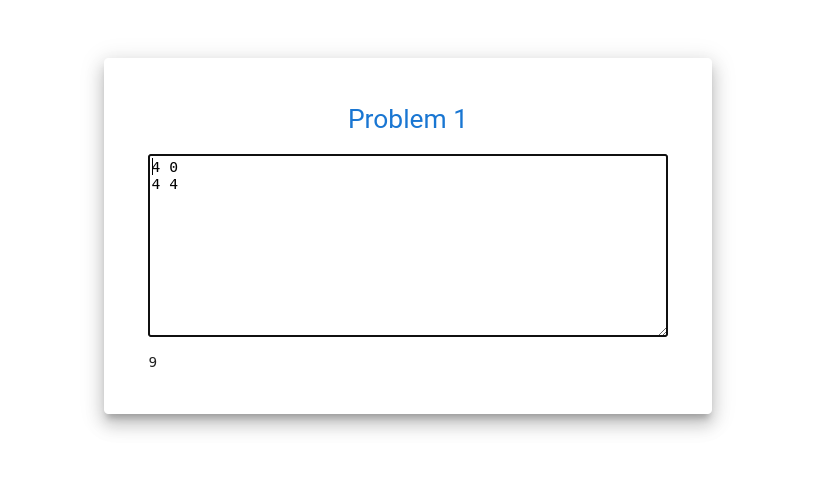
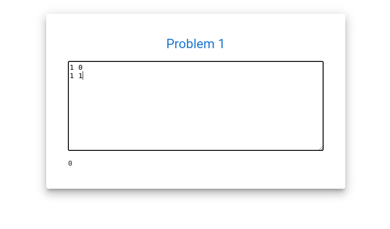
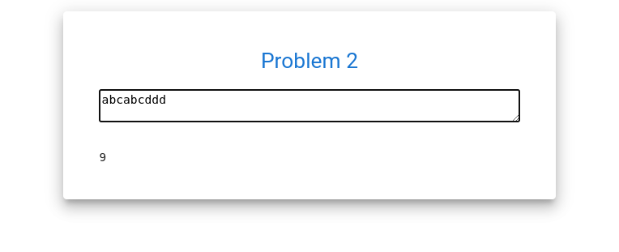

# a2o_technical_test
# Description
This repository is a technical trial for a2o dev.
# Packages Installed
Django: This is the backbone of the backend api, and has the following packages installed:

Django Rest Framework (For the Rest API)

Django-Cors-Headers (For the CORS config to allow React js to make calls)

Note: All this packages are specified in the requirements.txt file inside a2o_test folder. 

React: The frontend library in use. This was created via npx create-react-app. The only extra packages that were installed (ignoring the ones that are automatically pre-installed) are:

MUI  (For styling)
Axios (To make calls to the Django Backend)
React-Router-Dom and Router-Dom (For managing routing)

# Install (Run) with Docker
Before install make sure you have installed docker compose in your enviroment

Clone the repo:

git clone https://github.com/jdavisd/a2o_technical_test.git

Run Docker-Compose:

docker-compose up -d --build
The app should be up and running. To access the React frontend go to localhost:3000, and to access the Django backend go to localhost:8000/api. 
# Problem 1 

# Problem 2 

